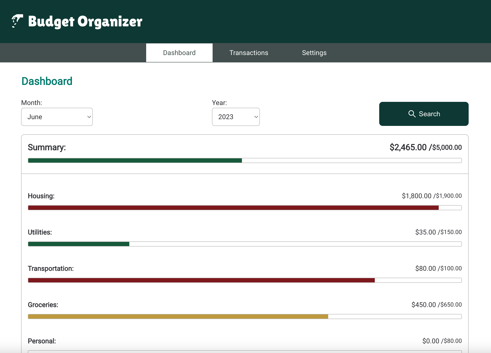
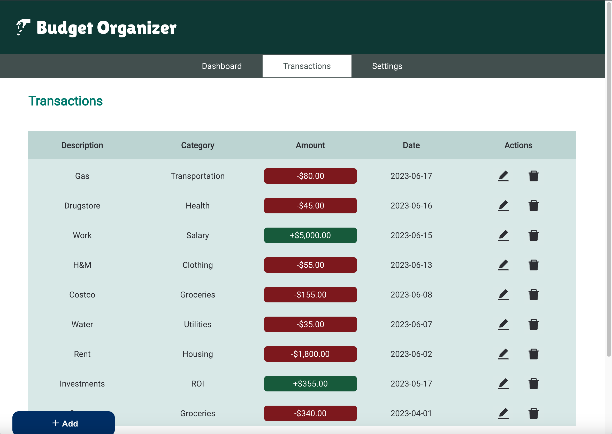
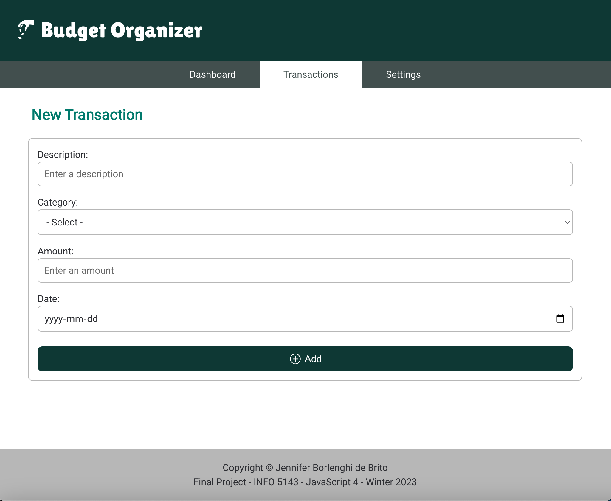
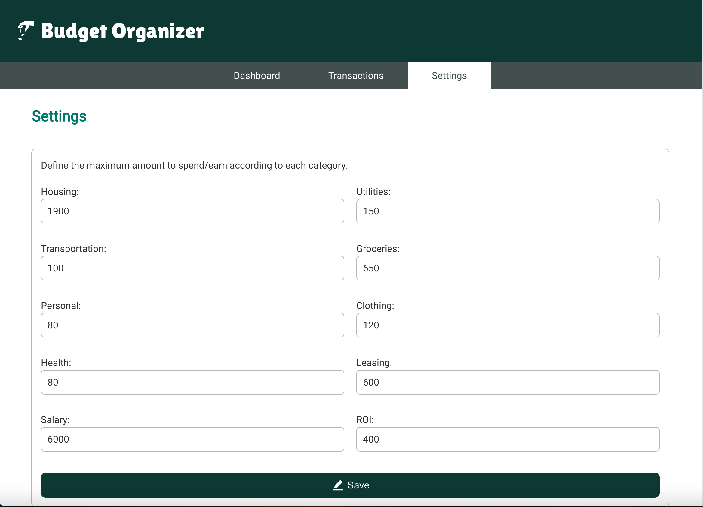

# Organize your bugdet!

An application that allows you to track your budget. Initially, you need to fill out how much you want to spend or earn in each transaction category: housing, utilities, transportation, groceries, personal, clothing, health, leasing, salary, and ROI (Return on Investments). The default values will be used if you do not fill out that.
Then you can add, edit, and delete any transaction you have done. After any change, the summary and the dashboard information will be updated automatically.
The dashboard summarizes the transactions by category using progress bars with different colours to let the user know if he would avoid spending in some section or focus on earning more in a category. Moreover, you can filter the month and year of your transactions on the dashboard page.

## Watch the presentation video

This project was done for the Javascript 4 course from Web Development and Internet Applications course at Fanshawe College. That's mentioned in the video and the footer of the project.

https://share.vidyard.com/watch/b4KeNuFAXEm5LyjDrjHgk6

## What did I use to build this application?

- React, React Icons, React Router Dom
- SCCS, CSS
- Firebase Firestore
- Vercel: https://final-project-js4-jborlenghidebrito.vercel.app/

## Routes

1. “/” to display the dashboard:
   

2. “/transactions” to show and edit transactions:
   

3. “/transactions/add” to add a new transaction:
   

4. “/settings” to update the amount to spend/earn in each transaction category:
   

## How to use

1. Install the packages

```bash
npm install
```

2. Start the applications

```bash
npm start
```

## Project Structure

```
PROJECT_ROOT
├── public
├── readme-files
├── src
│   └── components          # React components
│   └── database            # Firebase config and functions
│   └── helperFunction
│   └── includes
│   └── pages
│   └── redux
│   └── styles              # SCSS styles
│   └── App.js
│   └── index.js
```
